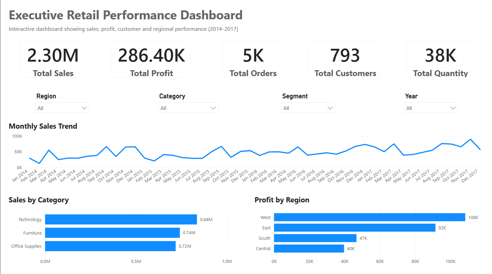
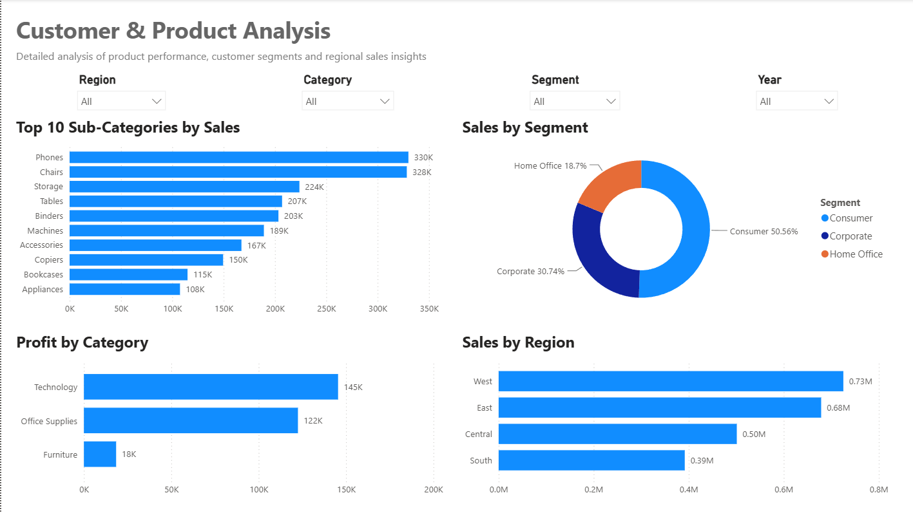

# 📊 Executive Retail Performance Intelligence Dashboard

An interactive Power BI dashboard built to analyze retail sales performance, profitability, customer behavior, product performance, and regional trends. The dashboard transforms raw transactional data into actionable business insights through executive-level KPIs and detailed analytical reports.

---

## Dashboard Preview

### Executive Dashboard

---

### Customer & Product Analysis

---

# Project Overview

This project demonstrates an end-to-end business intelligence workflow using Power BI.

The objective was to design a dashboard that enables business stakeholders to monitor overall performance, identify profitable business segments, evaluate product performance, and support data-driven decision making.

The report is divided into two interactive pages:

- Executive Dashboard
- Customer & Product Analysis

---

# Business Objectives

- Monitor overall business performance using executive KPIs
- Analyze monthly sales trends
- Compare category and regional performance
- Identify the highest-performing product sub-categories
- Understand customer segment contribution
- Enable interactive filtering for business users

---

# Key KPIs

- Total Sales
- Total Profit
- Total Orders
- Total Customers
- Total Quantity Sold

---

# Dashboard Features

### Executive Dashboard

- Executive KPI Cards
- Monthly Sales Trend Analysis
- Sales by Category
- Profit by Region
- Interactive Filters
  - Region
  - Category
  - Segment
  - Year

### Customer & Product Analysis

- Top 10 Sub-Categories by Sales
- Profit by Category
- Sales by Region
- Sales by Customer Segment

---

# Business Insights

Some key insights generated from the dashboard include:

- Technology is the highest revenue-generating category.
- The West region contributes the highest overall sales and profit.
- Consumer customers account for the largest share of total sales.
- Sales show a consistent upward trend over the reporting period.
- Product performance varies significantly across sub-categories, highlighting opportunities for inventory and pricing optimization.

---

# Tools & Technologies

- Power BI
- Power Query
- DAX
- Data Modeling
- Data Visualization

---

# Skills Demonstrated

- Business Intelligence
- Dashboard Design
- KPI Development
- Data Cleaning
- Data Modeling
- DAX Measures
- Executive Reporting
- Interactive Visualizations
- Business Analysis
- Data Storytelling

---

# Future Improvements

- Forecasting using time-series analysis
- Customer profitability analysis
- Drill-through pages
- Dynamic KPI targets
- Geographic map visualizations

---

## Connect With Me

If you found this project interesting or would like to discuss analytics opportunities, feel free to connect with me on LinkedIn.
