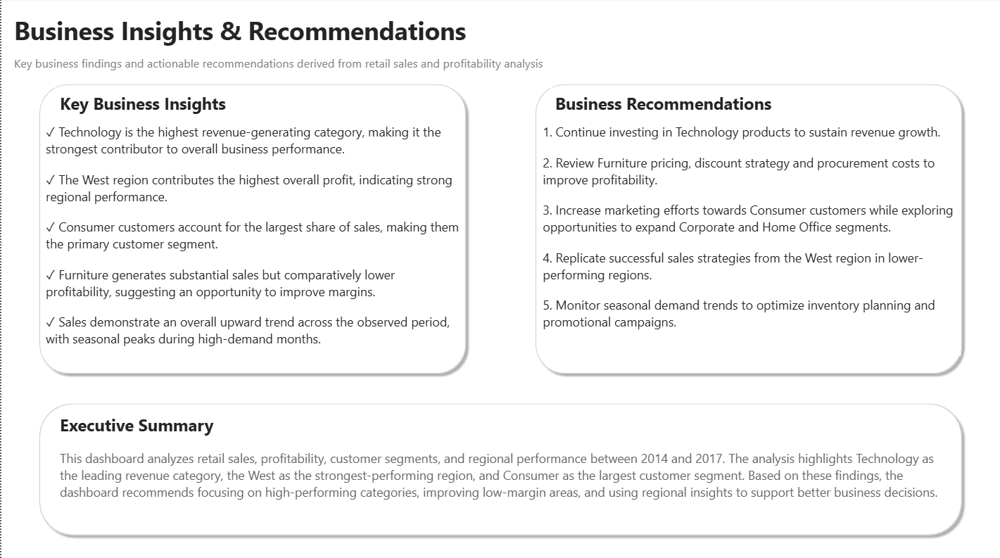

# 📊 Retail Executive Performance Dashboard


An interactive **Power BI Business Intelligence dashboard** developed to analyze retail sales performance, customer behavior, profitability, and regional trends. The dashboard transforms raw transactional data into meaningful business insights and actionable business recommendations for executive decision-making.

---

# 📑 Table of Contents

- [📊 Executive Summary](#-executive-summary)
- [🎯 Business Problem](#-business-problem)
- [💡 Solution](#-solution)
- [✨ Project Highlights](#-project-highlights)
- [🛠️ Tech Stack](#️-tech-stack)
- [📌 Dashboard Overview](#-dashboard-overview)
- [📈 Key KPIs](#-key-kpis)
- [🔍 Key Business Insights](#-key-business-insights)
- [🚀 Business Recommendations](#-business-recommendations)
- [⚙️ Project Workflow](#️-project-workflow)
- [📂 Repository Structure](#-repository-structure)
- [💼 Skills Demonstrated](#-skills-demonstrated)
- [🎯 Business Value](#-business-value)
- [🔮 Future Improvements](#-future-improvements)
- [▶️ How to Run](#️-how-to-run)
- [👨‍💻 Author](#-author)

---

# 📊 Executive Summary

This project demonstrates the complete development of an executive-level Business Intelligence solution using **Power BI**. It converts raw retail sales data into interactive dashboards that enable stakeholders to monitor business performance, evaluate profitability, analyze customer behavior, identify growth opportunities, and support strategic decision-making through data visualization.

---

# 🎯 Business Problem

Retail businesses generate thousands of transactions across different regions, customer segments, and product categories. Decision-makers often struggle to quickly identify:

- Which product categories generate the highest revenue?
- Which regions contribute the highest profit?
- Which customer segment drives business growth?
- How sales change over time?
- Where should management focus to improve profitability?

This dashboard addresses these challenges by transforming raw sales data into interactive business insights.

---

# 💡 Solution

Developed a **3-page interactive Power BI dashboard** that enables stakeholders to:

- Monitor key business KPIs
- Analyze sales and profitability
- Compare regional performance
- Understand customer segments
- Evaluate product performance
- Generate actionable business recommendations

---

# ✨ Project Highlights

- 📊 Built a **3-page interactive executive dashboard**
- 📈 Analyzed **5,000+ retail orders**
- 💰 Tracked Sales, Profit, Orders, Customers, and Profit Margin
- 🌍 Compared regional performance
- 👥 Analyzed customer purchasing behavior
- 📦 Evaluated product category performance
- 💡 Generated business recommendations based on analytical insights

---

# 🛠️ Tech Stack

| Tool | Purpose |
|------|---------|
| 📊 Power BI | Dashboard Development |
| ⚡ Power Query | Data Cleaning & Transformation |
| 🧮 DAX | KPI Calculations |
| 📄 Excel | Dataset |
| 📈 Data Visualization | Business Reporting |

---

# 📌 Dashboard Overview

## 1️⃣ Executive Dashboard

Provides an executive-level overview of business performance through interactive KPIs and trend analysis.

### Features

- Total Sales
- Total Profit
- Total Orders
- Total Customers
- Profit Margin %
- Monthly Sales Trend
- Sales by Category
- Profit by Region
- Interactive Filters

### Preview


---

## 2️⃣ Customer & Product Analysis

Provides detailed analysis of customer segments, regional sales, and product performance.

### Features

- Top Selling Products
- Sales by Customer Segment
- Profit by Category
- Regional Sales Comparison

### Preview


---

## 3️⃣ Business Insights & Recommendations

Summarizes analytical findings into actionable business recommendations.

### Features

- Executive Summary
- Key Business Insights
- Business Recommendations

### Preview



---

# 📈 Key KPIs

| KPI | Value |
|------|-------|
| 💰 Total Sales | 2.3M |
| 💵 Total Profit | 286.4K |
| 📦 Total Orders | 5K |
| 👥 Total Customers | 793 |
| 📊 Profit Margin | 12.47% |

---

# 🔍 Key Business Insights

- ✅ Technology generated the highest overall sales.
- ✅ West region delivered the highest profitability.
- ✅ Consumer segment contributed the largest share of revenue.
- ✅ Furniture achieved high sales but comparatively lower profit margins.
- ✅ Sales exhibited a positive long-term trend with seasonal fluctuations.

---

# 🚀 Business Recommendations

- Continue investing in Technology products.
- Review pricing and discount strategies for Furniture.
- Replicate successful sales practices from the West region.
- Strengthen customer retention initiatives for Consumer customers.
- Improve inventory planning during seasonal demand peaks.

---

# ⚙️ Project Workflow

```text
                    Retail Sales Dataset
                            │
                            ▼
                Power Query (Data Cleaning)
                            │
                            ▼
                 Data Transformation & Modeling
                            │
                            ▼
                  DAX Measures & KPIs
                            │
                            ▼
               Interactive Power BI Dashboard
                            │
                            ▼
             Business Insights & Recommendations
```

---

# 📂 Repository Structure

```text
Retail-Executive-Performance-Dashboard
│
├── Dashboard
│   └── Retail_Executive_Performance_Dashboard.pbix
│
├── Dataset
│   └── Superstore_Dataset.xlsx
│
├── Screenshots
│   ├── 01_Executive_Dashboard.png
│   ├── 02_Customer_Product_Analysis.png
│   └── 03_Business_Insights_&_Recommendations.png
│
├── LICENSE
│
└── README.md
```

---

# 💼 Skills Demonstrated

### Business Intelligence

- Interactive Dashboards Developed
- KPI Design
- Executive Reporting
- Data Storytelling

### Data Preparation

- Data Cleaning
- Data Transformation
- Data Validation

### Power BI

- Power Query
- DAX Measures
- Interactive Slicers
- Cross-filtering
- Drill-down Analysis

### Business Analytics

- Sales Analysis
- Profitability Analysis
- Customer Segmentation
- Regional Performance Analysis
- Business Recommendations

---

# 🎯 Business Value

The dashboard enables business stakeholders to monitor performance through a single interactive report. It supports better strategic decision-making by identifying profitable categories, high-performing regions, customer trends, and potential improvement opportunities.

---

# 🔮 Future Improvements

- Integrate SQL Database
- Implement Python-based Sales Forecasting
- Build Customer Churn Analysis
- Deploy to Power BI Service
- Automate Data Refresh
- Implement Row-Level Security (RLS)

---

# ▶️ How to Run

1. Download the `.pbix` file.
2. Open it using **Microsoft Power BI Desktop**.
3. Load the dataset if prompted.
4. Explore the report using the interactive filters and slicers.

---

# 👨‍💻 Author

**Harsh**

B.Tech, Electrical Engineering  
Delhi Technological University (DTU)

**Interested in:** Business Analytics • Data Analytics • Business Intelligence
